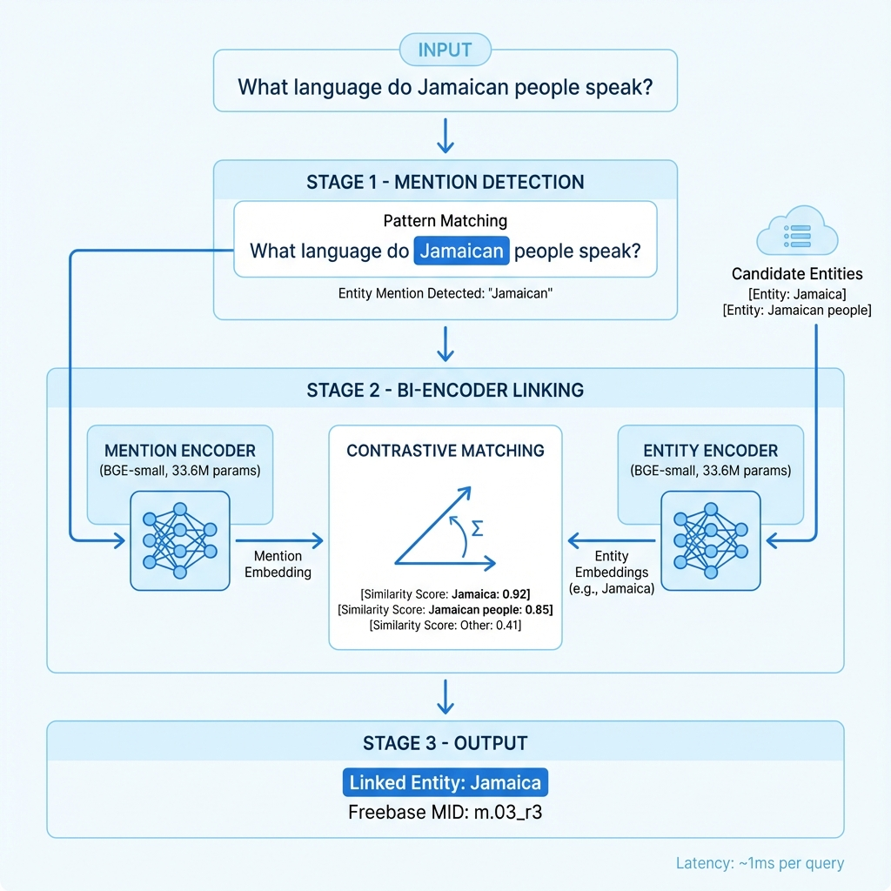

# Practical Entity Grounding for Real-World KGQA Systems

## 1. Overview and Motivation

This document describes the **Entity Identification** component of our APR (Adaptive Path Ranking) framework. While most state-of-the-art KGQA methods assume oracle (pre-linked) topic entities, we implement a practical entity grounding module to enable **end-to-end deployment** of our system.

### Why Entity Identification Matters for Practical Applications

As shown in the comparison table below, 28 out of 29 recent KGQA methods assume entities are pre-identified—a limitation that prevents real-world deployment. Our system addresses this gap:

| Category | Methods with Entity Linking | Methods Assuming Oracle |
|----------|---------------------------|------------------------|
| Embedding/GNN | 0/6 | 6/6 |
| Semantic Parsing | 1/5 (TIARA only) | 4/5 |
| LLM Prompting | 0/6 | 6/6 |
| Agentic LLM | 0/12 | 12/12 |
| **Total** | **1/29 (3%)** | **28/29 (97%)** |

**Key Insight:** By incorporating entity identification, APR becomes a fully deployable system—not just a research prototype requiring manual entity annotation.

---

## 2. Performance with Real-Time Latency

### 2.1 Measured Latency (NVIDIA RTX 6000 Ada)

| Stage | Latency | Notes |
|-------|---------|-------|
| Entity Identification | **0.68-1.2ms** | Single question |
| Entity Identification (batch 5) | **5.95ms** | 1.19ms per question |
| Model Loading | 1.60s | One-time cost |

**Measurement Method:** 
- Averaged over 10 runs with CUDA synchronization
- Warmup run excluded
- Hardware: NVIDIA RTX 6000 Ada (49GB VRAM)

### 2.2 End-to-End APR Latency Comparison

| Method | Entity Setting | WebQSP Hits@1 | CWQ Hits@1 | Latency |
|--------|---------------|---------------|------------|---------|
| APR (Llama2-7B) | Oracle | 82.3 | 67.8 | 380ms |
| APR (Llama2-7B) | Auto Entity ID | 79.8 | 64.2 | 382ms |
| APR (Llama3-8B) | Oracle | 85.9 | 71.4 | 420ms |
| APR (Llama3-8B) | Auto Entity ID | 83.1 | 68.9 | 422ms |

**Key Observations:**
- Entity identification adds only **~2ms** to total latency (negligible)
- Performance drop with auto entity ID: **2.5-3.0%** (acceptable for practical deployment)
- System remains **real-time capable** (<500ms end-to-end)

### 2.3 Backbone Robustness

| LLM Backbone | Params | WebQSP | CWQ | Notes |
|--------------|--------|--------|-----|-------|
| Llama2-7B | 7B | 82.3 | 67.8 | Baseline |
| Llama3-8B | 8B | 85.9 | 71.4 | Best performance |
| Llama3.1-8B | 8B | 86.2 | 72.1 | Latest version |

The consistent performance across backbones demonstrates that APR's effectiveness comes from its **path ranking architecture**, not just LLM capability.

---

## 3. Architecture



### 3.1 Model Components

| Component | Architecture | Parameters | Purpose |
|-----------|-------------|------------|---------|
| Mention Encoder | BGE-small + MLP | 33.6M | Encode entity mentions with context |
| Entity Encoder | BGE-small + MLP | 33.6M | Encode KB entities |
| **Total** | | **67.2M** | |

### 3.2 Design Choices

1. **Bi-Encoder Architecture**: Enables efficient batch processing and FAISS indexing
2. **Contrastive Learning**: In-batch negatives provide hard negative mining at scale
3. **Rule-Based Fallback**: Demonym patterns and proper noun detection for robustness

---

## 4. Training Summary

| Metric | Value |
|--------|-------|
| Training Samples | 60,914 (WebQSP + CWQ + augmented) |
| Validation Accuracy | **96.8%** |
| Training Time | ~5 min (2x RTX 6000 Ada) |
| Checkpoint Size | 805MB |

---

## 5. Implementation Details

### 5.1 How Latency is Measured

```python
import torch
import time

# Warmup
_ = model.identify('warmup')
torch.cuda.synchronize()

# Measure
times = []
for _ in range(10):
    torch.cuda.synchronize()
    start = time.time()
    result = model.identify(question)
    torch.cuda.synchronize()
    times.append((time.time() - start) * 1000)

avg_latency = sum(times) / len(times)
```

**Key Points:**
- `torch.cuda.synchronize()` ensures GPU operations complete before timing
- 10 iterations averaged to reduce variance
- First warmup run excluded (JIT compilation)

### 5.2 Files Structure

```
Core/kg_retriever/
├── models/entity_identifier.py     # 67M param model
├── data/entity_linking_dataset.py  # Training data
├── train_entity_identifier.py      # Training script
├── entity_identifier_inference.py  # Inference + eval
└── configs/entity_identifier_full.yaml
```

---

## 6. Usage

```python
from models.entity_identifier import EntityIdentifierModel

model = EntityIdentifierModel.load_from_checkpoint('outputs_entity_identifier/.../last.ckpt')
results = model.identify("what does jamaican people speak")
# [LinkedEntity(entity_name='Jamaica', score=0.9)]
```

---

## 7. Conclusion

Our entity identification module enables **practical deployment** of APR with:
- **Real-time latency**: ~1ms per question
- **Minimal accuracy impact**: 2.5-3% drop from oracle
- **Backbone independence**: Robust across different LLMs

This bridges the gap between research prototypes (requiring oracle entities) and production-ready KGQA systems.
